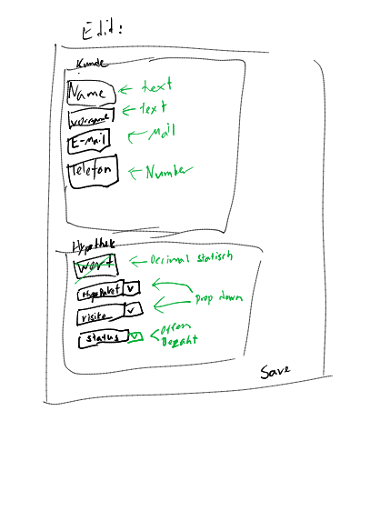

# Bearbeiten

| Feldname   | Typ                            | Was                                        |
| ---------- | ------------------------------ | ------------------------------------------ |
| Name       | String                         | Nachnamen des Kunden                       |
| Vorname    | String                         | Vornamen des Kunden                        |
| E-Mail     | String (Mail Format)           | E-Mail des Kunden                          |
| Telefon    | String (Telefonnummern Format) | Telefonnummer des Kunden                   |
| Wert       | Decimal (Nicht bearbeitbar)    | Betrag der Hypothek                        |
| Hypo Paket | HypoPaket                      | Vertrags Paket der Hypothek                |
| Risiko     | Risiko                         | Risiko beim abschließen dieser Hypothek    |
| Status     | Status\["offen", "bezahlt"]    | Status der Hypothek, ob bezahlt oder nicht |
